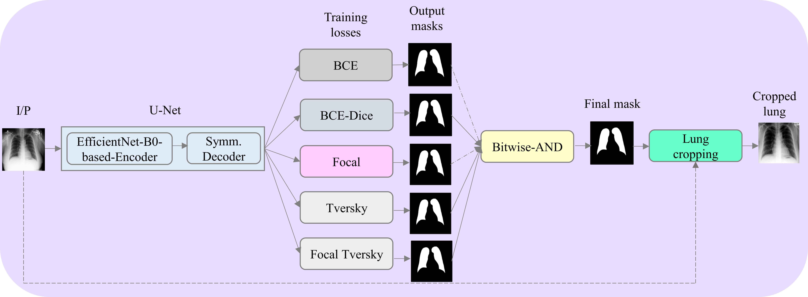
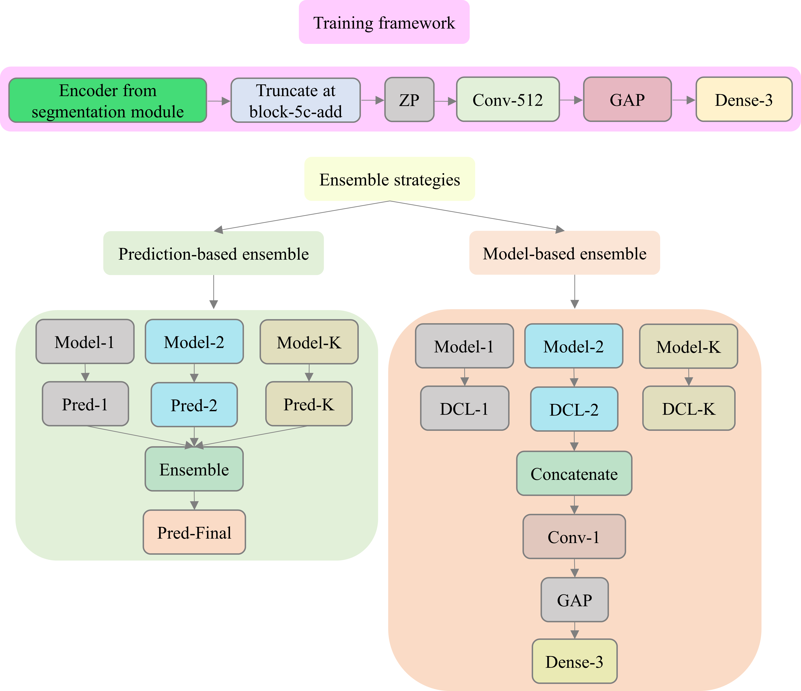

# Multiloss_ensemble_learning_imbalanced_classification
The code proposes various novel loss functions to train the DL models and construct their ensembles to improve performance in a class-imbalanced multiclass classification task using chest radiographs

## Requirements:
Tenforflow == 2.4.0

Keras == 2.4.0

#other supporting libraries as mentioned in the code

# Aim and objective of the study:
Class imbalance is common in medical image classification tasks, where the number of abnormal samples is fewer than the number of normal samples. The difficulty of imbalanced classification is compounded by other issues such as the size and distribution of the dataset. Reliable training of deep neural networks continues to be a major challenge in such class-imbalanced conditions. The loss function used to train the deep neural networks highly impact the performance of both balanced and imbalanced tasks. Currently, the cross-entropy loss remains the de-facto loss function for balanced and imbalanced classification tasks. This loss, however, asserts equal learning to all classes, leading to the classification of most samples as the majority normal class. To provide a critical analysis of different loss functions and identify those suitable for class-imbalanced classification, we benchmark various state-of-the-art loss functions and propose novel loss functions to train a DL model and analyze its performance in a multiclass classification setting that classifies pediatric chest X-rays (CXRs) as showing normal lungs, bacterial pneumonia, or viral pneumonia manifestations. We also construct prediction-level and model-level ensembles of the models that are trained with various loss functions to improve classification performance. Our results show that the weighted averaging of the predictions for top-3 and top-5 model-level ensembles delivered significantly superior classification performance (p < 0.05) in terms of accuracy (0.9391), area under the receiver-operating characteristic curve (0.9933), area under the precision-recall curve (0.9881), precision (0.9396), recall (0.9391), F-score (0.9392), and MCC (0.9068, 95% confidence interval (0.8839, 0.9297)) as compared to the individual models and the state-of-the-art literature. We performed localization studies to interpret models’ behavior to ensure that the individual models and their ensembles precisely learned the regions of interest showing disease manifestations to classify the CXRs to their respective categories.  
## Block Diagrams:

The figure below shows the segmentation module proposed in this study. An EfficientNet-B0-based U-Net model is used to generate lung masks. The predicted lung masks for the pediatric CXR collection published by Kermany et al. is overlaid on the original CXRs, the ling boundaries are delineated and cropped. The cropped lungs are further used for classification studies.

The classification module proposed in this study is shown below.

We further performed localization studies using Grad_CAM to localize the disease ROIs learned by the indiviudal models that are trained with various loss functions and the model-level ensembles. The models precisely learned the ROIs as shown below.

